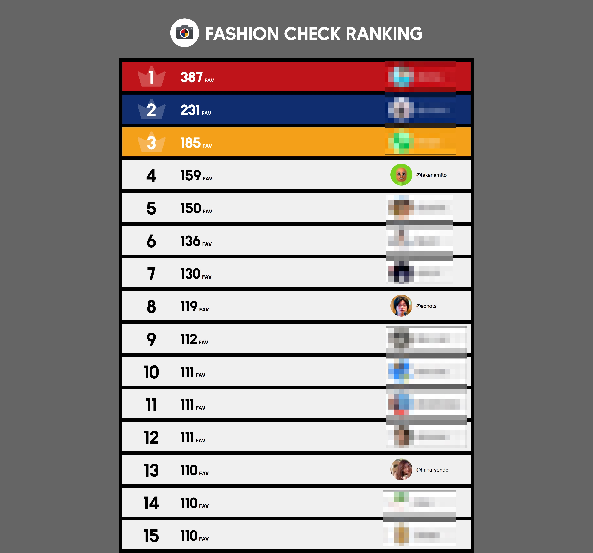
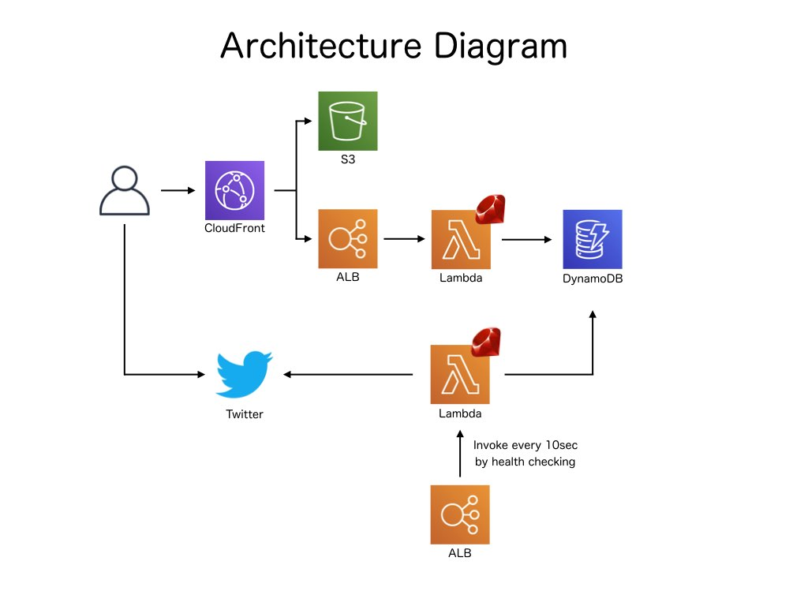

# fashion_check\_ranking

A web application for RubyKaigi 2019 sponsor booth contents.

## What is this?

fashion_check\_ranking contains an web application and tweet crawler.  
The application is Sinatra app that shows Ranking page of FashionCheck Score.   
And tweet crawler searches tweet by FashionCheck App. [example](https://twitter.com/hana_yonde/status/1108884458810146816)

If you measure your coordinate score through our App and tweet it, you can see "Where does your coordinate score rank in the event".

## Architecture

All of applications runs on AWS Lambda Ruby runtime.  

## Copyright

COPYRIGHT (c) ZOZO Technologies, Inc.